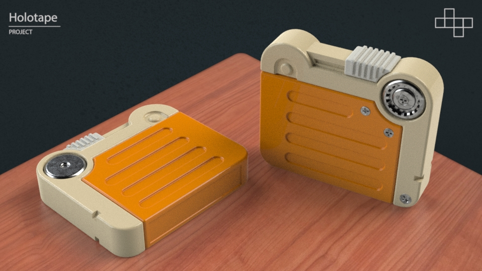

# NFC Terminal

**Goal:** Vintage cartridge computer that stores data via NFC key fobs.

| Holotape | Computer |
| -------- | -------- |
|  | ... |

## Guides

| Guide | Description |
| ----- | ----------- |
| [Holotape](docs/holotape.md) | Step by step guide for making a Holotape cartridge. |
| [Computer](docs/computer.md) | Step by step guide for building the computer. |
| [FAQ](docs/faq.md) | Troubleshooting and other steps. |

## Hardware

- Raspberry Pi 3 or better
  - Tested on Raspberry Pi 4
- PN532 Chip
  - https://www.amazon.com/gp/product/B01I1J17LC/
  - You do need to solder the 4 pins to the board.
  - UART works best as the node-i2c library is not complete
- 1024x600 7" HDMI Display.
  - https://www.amazon.com/gp/product/B07Y889J3X/
- MIFARE DESFire EV1 2k/4k/8k Fobs
  - https://www.amazon.com/gp/product/B07D925N54/
  - Not using security stuff, but EV2 would work also.

## Software

Really tried to keep this as basic as possible.
- Express for handling requests.
- Plain HTML + JS + CSS... one `index.html` file.
- `Consolas` is assumed to be installed.

## Shell

The files are optimized for a SLA Resin printer.

## NFC Lifecycle

- LED Off
- Ready
  - Cartridge slot LED Solid
  - Wait for cartridge
    - Cartridge Inserted
      - Cartridge slot LED Pulses
      - Read cartridge data
      - Data modification is written
    - Cartridge Removed
  - Repeat Wait for Cartridge

## Data

All records must exist for the cartridge to be properally read.

> If type is not found it is treated as new cartridge. Use a phone to reset chip.

- Type (20 chars)
  - `text`, `markdown`, `javascript`
- Total Writes (10 chars)
  - `42`
- Created Date (20 chars)
  - `2021-05-09T19:31:31Z`
- Modified Date (20 chars)
  - `2021-05-09T19:31:31Z`
- Text (~2k/4k/8k minus 70 chars)
  - All text data.