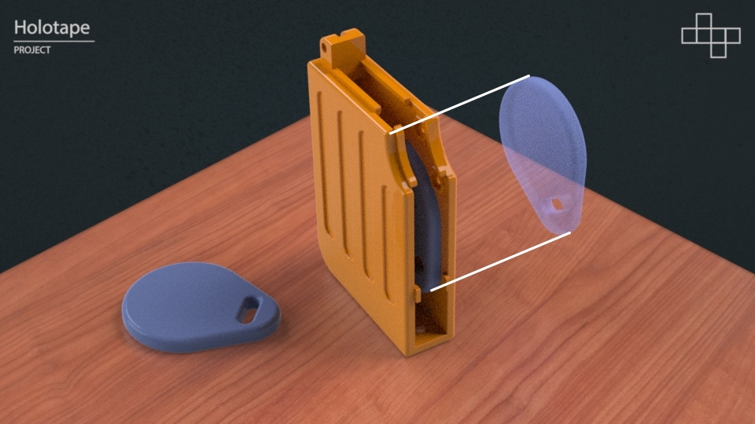

# Holotape

The Holotape design is based on the [Fallout 4](https://en.wikipedia.org/wiki/Fallout_4) fictional data cartridge.

> **Requirements:** This project requires a Resin printer. An airbrush is highly recommended for painting.

## Printing

Resin printing a Holotape can be done in a single print on most resin printers with over a 6" panel.

| Part | Preview | STL | Pre-Supported STL |
| ---- | ------- | --- | ----------------- |
| Main |  | main.stl | main_supported.stl |
| Panel |  | panel.stl | panel_supported.stl |
| Spinner Front |  | spinner_front.stl | spinner_front_supported.stl |
| Spinner Back |  | spinner_back.stl | spinner_back_supported.stl |
| Slider |  | slider.stl | slider_supported.stl |

> Note: Pre-supported are highly recommended as they are setup to offer minimal sanding, but may use more resin.

- Clean parts leaving supports connected.
- Leave parts in very warm water. Supports should remove with very little effort.
- Air dry parts until completely **dry**.
- UV cure parts.

## Sanding

With 800 grit sand paper carefully wet sand the surfaces of the part including down any support locations.

> For pre-supported models focus on the connecting points between the main body and label.

## Cleaning

To ensure adhesion of the primer.

- Clean with soap and water rinse clean.
- Air dry parts until completely **dry**.
- Set aside in dust free container!

## Painting

This is the most difficult part and requires the most time to ensure quality.

The process below is what worked in testing, but if you have time and different paints you can probably get similar results. An airbrush is preferred for smoother consistent layers.

> Note: Do not skip the minimum dry time between coats. This is especially true for the varnish layers.

| Paint | Alternative |
| ----- | ----------- |
| Vallejo Surface White Primer | White Primer |
| Vallejo Surface Grey Primer | Grey Primer |
| Vallejo Game Air Dull Aluminum | Aluminum |
| Vallejo Game Air Orange Fire | Citadel Air Troll Slayer Orange |
| Vallejo Model Air Aged White | Citadel Air Typhon Ash |
| Vallejo Model Stonewall Grey | Lighter Grey |
| Vallejo Satin Varnish | Any Satin Varnish |
| Vallejo Airbrush Thinner | Water |

> Note: Do not forget to thin the Satin Varnish with thinner for an even coat. Or paint it on.

### Main Body

**Goal:** Off white that looks like an vintage computer white.

1. White Primer; 1 Coat
2. _[Dry Time 4 Hours]_
3. Aged White; 2 Coats
4. _[Dry Time 4 Hours]_
5. Satin Varnish; 2 to 3 Coats
6. _[Dry Time Next Day]_

**Recommended:** With a hand brush paint extra varnish around slider area.

### Panel (or Label) Body

**Goal:** By using Aluminum under Orange Fire the color will be more vibrant giving it a Sci-Fi look.

1. Grey Primer; 1 Coat
2. _[Dry Time 4 Hours]_
3. Dull Aluminum; 2 Coats
4. _[Dry Time 4 Hours]_
5. Orange Fire; 3 Coats
6. _[Dry Time 4 Hours]_
7. Satin Varnish; 2 to 3 Coats
8. _[Dry Time Next Day]_

### Spinner Front / Spinner Back

**Goal:** Make it look like metal.

1. Grey Primer; 1 Coat
2. _[Dry Time 4 Hours]_
3. Dull Aluminum; 2 Coats
4. _[Dry Time 4 Hours]_
5. Satin Varnish; 2 to 3 Coats
6. _[Dry Time Next Day]_

### Slider

**Goal:** Dull'ish plain grey switch. Rotate part to ensure even fill into ridges.

1. Grey Primer; 1 Coat
2. _[Dry Time 4 Hours]_
3. Stonewall Grey; 2 Coats
4. _[Dry Time 4 Hours]_
5. Satin Varnish; 2 to 3 Coats
6. _[Dry Time Next Day]_

## Assembly

The Holotape requires physical hardware for a few reasons.

- Durability - Stronger contact points allow reassembly if required.
- Visuals - Screws produce a realistic look.
- Magnets - Longevity of switch mechanism.

| Part | Quantity |
| ---- | -------- |
| 5mm Depth 4mm Diameter Magnet | 2 |
| M2.5 8mm Flat Head Screw | 2 |
| M2.5 Nut | 2 |
| M2 8mm Flat Head Screw | 1 |
| M2 4mm Flat Head Screw | 2 |
| M2 Nut | 3 |
| Optional 8KB NFC Key Fob | 1 |

> Assorted screw / nut sets in stainless steel are ideal. Neodymium magnets preferred N45+.

### (Optional) Data Key Fob

Super glue key fob into Panel body. Placement will ensure the NFC reader will align when inserted into the slot.

> **Note:** Super glue to the correct side or the NFC scanner may not be able to read key fob.

### Visual Screws in Panel

The two smaller M2 4mm screws placed into the Panel body are completely for visuals.

### Slider Magnets

Two 4mm (diameter) by 5mm (depth) circle neodymium magnets are used to allow the slider to snap closed. Ensure magnets are pulling toward one another prior to assembly.

> **Note:** Cheaper non-neodymium magnets may not be strong enough for the slider to function. Look for N45+ strength.

After inserting magnets carefully push Slider into the Main body. This require light force, but try not to scratch the paint or break slider.

Ensure the slider works before proceeding.

### Main Body and Panel Body

Using the M2.5 screws and M2.5 nuts assemble the two main parts together.

[Insert Image Here]

### Spinner

The spinner is last as it often requires sanding to ensure a smooth operation.

Using the M2 nut and M2x8mm screw connect both halves of the spinner. This may require trial and error so do not fully tighten until the parts spin freely.

[Insert Image Here]

## Final

[Insert Image Here]