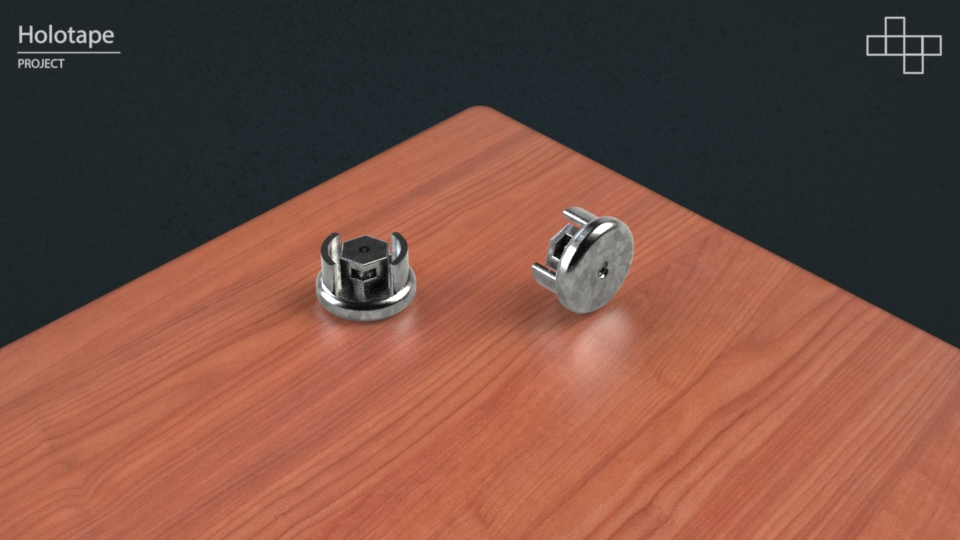

# Holotape

Design based on the [Fallout 4](https://en.wikipedia.org/wiki/Fallout_4) fictional data cartridge. To make the project easier these use NFC data key fobs, unlike tape like the name implies.

| Requirements | Optional |
| -------- | ---------- |
| Resin Printer | Airbrush |
| Airbrush | |

## Printing

Resin printing a Holotape can be done in a single print on most resin printers with over a 6" panel.

| Part | Preview | STL | Pre-Supported STL |
| ---- | ------- | --- | ----------------- |
| Main |  | main.stl | main_supported.stl |
| Panel |  | panel.stl | panel_supported.stl |
| Spinner Front |  | spinner_front.stl | spinner_front_supported.stl |
| Spinner Back | spinner_back.stl | spinner_back_supported.stl |
| Slider | slider.stl | slider_supported.stl |

> Note: Pre-supported are highly recommended as they are setup to offer minimal sanding, but may use more resin.

- Clean parts leaving supports connected.
- Leave parts in very warm water. Supports should remove with very little effort.
- Air dry parts until completely **dry**.
- UV cure parts.

## Sanding

With 800 grit sand paper carefully wet sand the surfaces of the part including down any support locations.

> For pre-supported models focus on the connecting points between the main body and label.

## Cleaning

To ensure adhesion of the primer.

- Clean with soap and water rinse clean.
- Air dry parts until completely **dry**.
- Set aside in dust free container!

## Painting

This is the most difficult part and requires the most time to ensure quality.

The process below is what worked in testing, but if you have time and different paints you can probably get similar results. An airbrush is preferred for smoother consistent layers.

> Note: Do not skip the minimum dry time between coats. This is especially true for the varnish layers.

| Paint | Alternative |
| ----- | ----------- |
| Vallejo Surface White Primer | White Primer |
| Vallejo Surface Grey Primer | Grey Primer |
| Vallejo Game Air Dull Aluminum | Aluminum |
| Vallejo Game Air Orange Fire | Citadel Air Troll Slayer Orange |
| Vallejo Model Air Aged White | Citadel Air Typhon Ash |
| Vallejo Satin Varnish | Any Satin Varnish |
| Vallejo Airbrush Thinner | Water |

> Note: Do not forget to thin the Satin Varnish with thinner for an even coat. Or paint it on.

### Main Body

## Assembly

The Holotape requires physical hardware for a few reasons.

- Durability - Stronger contact points allow reassembly if required.
- Visuals - Screws produce a realistic look.
- Magnets - Longevity of switch mechanism.

| Part | Quantity |
| ---- | -------- |
| 5mm Depth 4mm Diameter Magnet | 2 |
| M2.5 8mm Flat Head Screw | 2 |
| M2.5 Nut | 2 |
| M2 8mm Flat Head Screw | 2 |
| M2 Nut | 3 |
| Optional NFC Key Fob | 1 |

> Assorted screw / nut sets in stainless steel are ideal. Neodymium magnets preferred N45+.

[Visual Assembly Instructions Here]